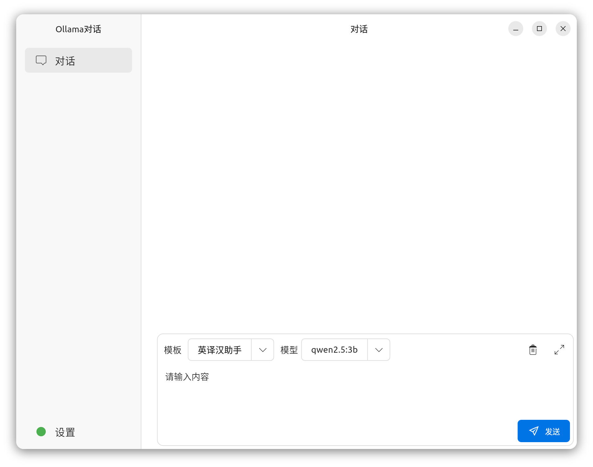
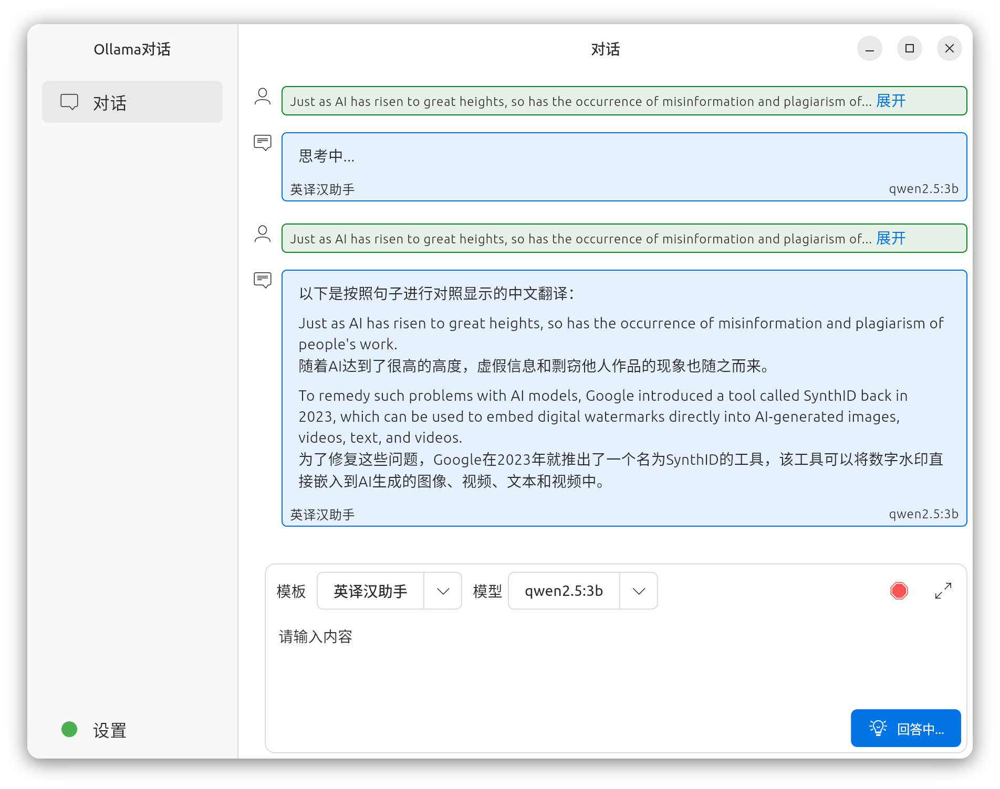
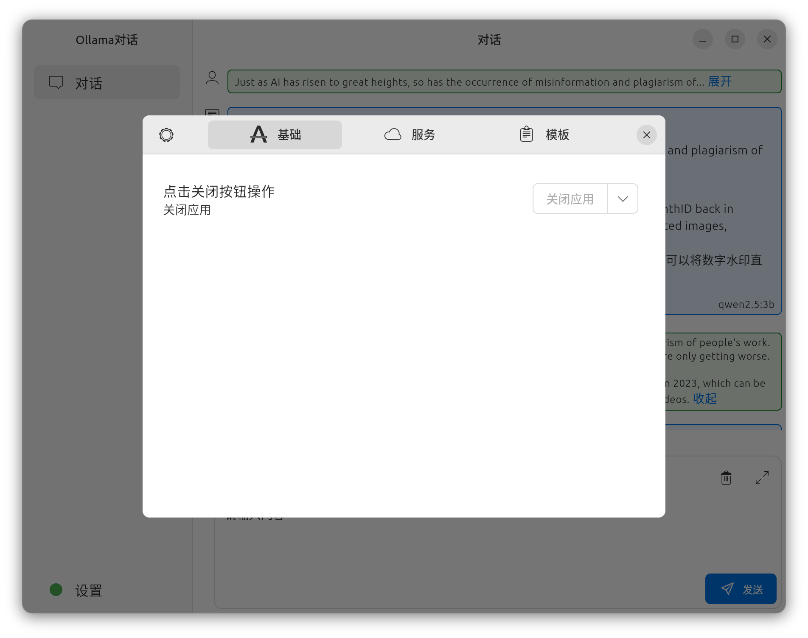

# ollama_gtk_client

a flutter app build with ubuntu style

## 使用参数说明
启动时支持简单的主题配置,比如:
```shell
ollama_gtk_client --theme=olive
或
ollama_gtk_client -t=olive
```
主题颜色支持:
- orange,
- bark,
- sage,
- olive,
- viridian,
- prussianGreen,
- blue,
- purple,
- magenta,
- red,
- wartyBrown,
- adwaitaBlue,
- adwaitaTeal,
- adwaitaGreen,
- adwaitaYellow,
- adwaitaOrange,
- adwaitaRed,
- adwaitaPink,
- adwaitaPurple,
- adwaitaSlate,

## 开始

使用flutter编写的yaru风味的ollama客户端

特性:
- [x] 对话功能
- [x] 指定模型
- [x] 指定模板
- [x] 调整对话时候的参数
- [x] 对话中添加图片(添加图片时，助手的模板内容失效)

## Flutter Dependencies 说明

| 技术 | 说明                       |
| --- |--------------------------|
| provider | 状态管理                     |
| handy_window | 外观                       |
| ollama_dart | ollama的调取实现              |
| bot_toast | 消息通知                     |
| flutter_distributor | 打包工具                     |
| flutter_markdown | markdown显示               |
| gtk | Canonical出品的GTK工具集合      |
| yaru | Canonical出品的Ubuntu风味外观   |
| safe_change_notifier | Canonical下的安全的provider管理 |


## 打包
安装打包插件

```
dart pub global activate flutter_distributor
```

deb打包
```
flutter_distributor package --platform linux --targets deb
```

## 项目效果图

### 默认图



### 聊天图



### 设置图


